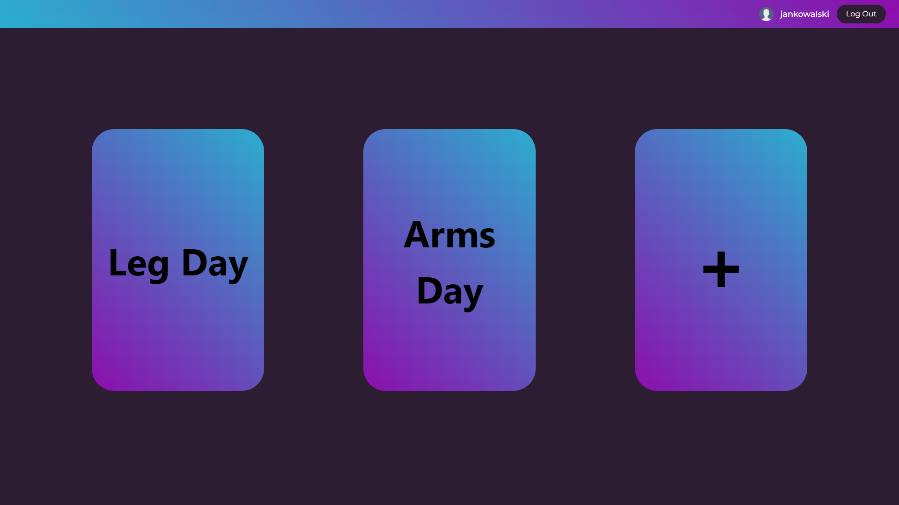
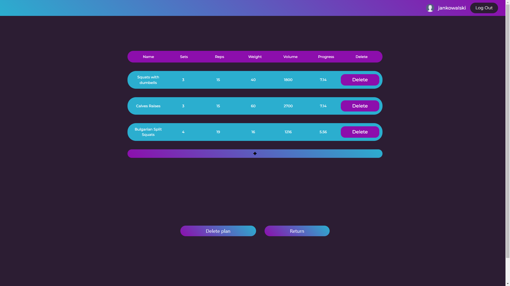
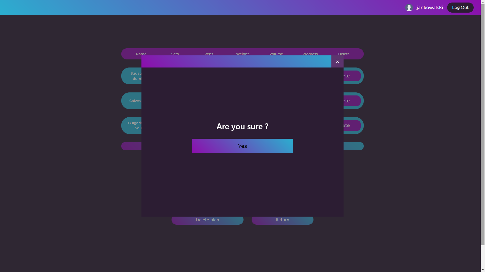

<h2>Training Tracker App</h2>

<h3>Features:</h3>

<ul>
    <li>creating training plan</li>
    <li>adding exercises with parameters like: sets, reps, weight</li>
    <li>calculcating training volume</li>
    <li>tracking your progress in %</li>
    <li>CRUD app</li>
    <li>login and register system</li>
</ul>

<h3>Screenshots:</h3>

 

 

<h3>Technologies I used:</h3>

<ul>
    <li>HTML</li>
    <li>CSS</li>
    <li>JS</li>
    <li>TS</li>
    <li>Astro</li>
    <li>Preact</li>
    <li>PHP</li>
    <li>MySQL</li>
    <li>Bootstrap</li>
</ul>

<h3>Project Setup:</h3>

<ul>
    <li>First you need to have node, npm and XAMPP installed</li>
    <li>Move server folder to htdocs folder in XAMPP installation directory</li>
    <li>Add .sql file to your phpMyAdmin</li>
    <li>Start APACHE and MySQL server using XAMPP control panel</li>
    <li>Open client folder in terminal and run "npm install" command</li>
    <li>Next run "npm run start" command</li>
    <li>You're ready to go</li>
</ul>